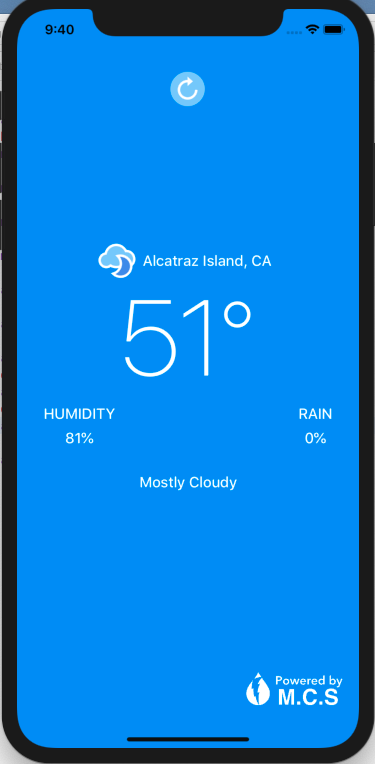

<h1>Weather App</h1>

Allows the user to view the current weather.  
MVVM(Model-View-View Model) architectural pattern was used.

<h2>Externally Used Library</h2>
<a href = "https://darksky.net/dev">DarkSky api</A> returns the current weather data by longitude, latitude, and private key sent.

<h2>Screenshot</h2>

